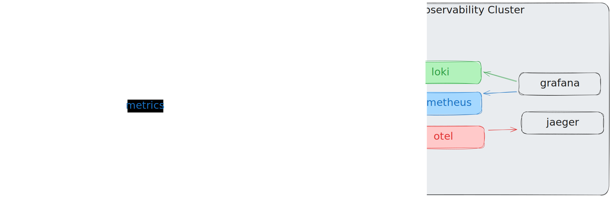

# Observability Documentation

> **Comprehensive observability practices across the fullstack homelab infrastructure**

---

## Table of Contents

- [Overview](#overview)
- [Architecture](#architecture)
- [Infrastructure Observability Stack](#infrastructure-observability-stack)
  - [Central Observability Cluster](#central-observability-cluster)
  - [Edge Observability (Multi-Cluster)](#edge-observability-multi-cluster)
  - [Application Monitoring](#application-monitoring)
- [Application-Level Instrumentation](#application-level-instrumentation)
  - [Demo Apps (Go Microservices)](#demo-apps-go-microservices)
  - [CKS Backend](#cks-backend)
  - [CKS Frontend](#cks-frontend)
- [Key Practices and Patterns](#key-practices-and-patterns)
- [Metrics, Logs, and Traces](#metrics-logs-and-traces)
- [Dashboards and Visualization](#dashboards-and-visualization)
- [Alerting](#alerting)
- [Best Practices](#best-practices)
- [Quick Reference](#quick-reference)

---

## Overview

This homelab showcases a **production-grade observability platform** implementing the three pillars of observability:

1. **Metrics** - Time-series data for system and application performance
2. **Logs** - Structured and centralized log aggregation
3. **Traces** - Distributed tracing across microservices

### Observability Stack

| Component | Technology | Purpose |
|-----------|-----------|---------|
| **Metrics** | Prometheus | Metrics collection and storage |
| **Logs** | Loki + Fluent Bit | Log aggregation and shipping |
| **Traces** | Jaeger + OpenTelemetry | Distributed tracing |
| **Visualization** | Grafana | Unified dashboards |
| **Storage** | MinIO (S3-compatible) | Long-term log storage |

---

## Architecture

### Multi-Tier Observability Architecture


---

## Infrastructure Observability Stack

### Central Observability Cluster

The central observability stack is deployed via the **observability module** ([modules/apps/observability](../modules/apps/observability/main.tf)).

#### Components

##### 1. OpenTelemetry Operator & Collector

**Helm Chart:** `opentelemetry-operator` v0.33.0
**Configuration:** [otel-operator-values.yaml.tpl](../modules/apps/observability/templates/otel-operator-values.yaml.tpl)

**Features:**
- OTLP gRPC receiver (port 4317)
- OTLP HTTP receiver (port 4318)
- Jaeger gRPC receiver (port 14250)
- Jaeger Thrift HTTP receiver (port 14268)
- Batch processing (1s timeout, 1024 batch size)
- Memory limiting (80% limit, 25% spike threshold)
- Health check endpoint (port 13133)

**Configuration File:** [otel-collector-config.yaml.tpl](../modules/apps/observability/templates/otel-collector-config.yaml.tpl)

```yaml
receivers:
  otlp:
    protocols:
      grpc:
        endpoint: 0.0.0.0:4317
      http:
        endpoint: 0.0.0.0:4318
  jaeger:
    protocols:
      grpc:
        endpoint: 0.0.0.0:14250
      thrift_http:
        endpoint: 0.0.0.0:14268

processors:
  batch:
    timeout: 1s
    send_batch_size: 1024
  memory_limiter:
    limit_percentage: 80
    spike_limit_percentage: 25

exporters:
  otlp:
    endpoint: jaeger-collector.observability.svc.cluster.local:4317
  logging: {}
```

##### 2. Jaeger Operator & Instance

**Helm Chart:** `jaeger-operator` v2.57.0
**Configuration:** [jaeger-operator-values.yaml.tpl](../modules/apps/observability/templates/jaeger-operator-values.yaml.tpl)

**Features:**
- Jaeger Query UI at `https://jaeger.fullstack.pw`
- Storage options: Memory (default), Elasticsearch, Cassandra
- Ingress with TLS (cert-manager)
- Collector endpoint: `jaeger-collector.observability.svc.cluster.local:4317`

**Access:** Open [https://jaeger.fullstack.pw](https://jaeger.fullstack.pw) to query traces

##### 3. Prometheus Stack (kube-prometheus-stack)

**Helm Chart:** `kube-prometheus-stack` v79.0.1
**Configuration:** [prometheus-values.yaml.tpl](../modules/apps/observability/templates/prometheus-values.yaml.tpl)

**Features:**
- Prometheus server at `https://prometheus.fullstack.pw`
- OTLP receiver enabled
- Remote write receiver for edge clusters
- Automatic cluster label injection
- Prometheus Operator for CRD management (ServiceMonitor, PodMonitor, PrometheusRule)

**Data Sources:**
- Self-scraping: `http://prometheus-operated:9090`
- Remote write endpoint: `/api/v1/write`

##### 4. Grafana

**URL:** `https://grafana.fullstack.pw`

**Configured Data Sources:**
- Prometheus: `http://prometheus-operated:9090`
- Loki: `http://loki-headless:3100`
- Jaeger: `http://jaeger-query:16686`

**Dashboards:**
- Unified Observability Dashboard (ConfigMap-based auto-discovery)
- Kubernetes cluster metrics
- Application metrics
- Log aggregation views

##### 5. Loki Stack

**Helm Chart:** `loki` v6.28.0
**Configuration:** [loki-values.yaml.tpl](../modules/apps/observability/templates/loki-values.yaml.tpl)

**Features:**
- Loki endpoint: `https://loki.fullstack.pw`
- Storage: MinIO S3-compatible (TSDB schema)
- Retention: 168 hours (7 days, configurable)
- Pattern ingester enabled
- Ruler enabled for alerting
- Structured metadata support

**Storage Configuration:**
```yaml
schema_config:
  configs:
    - from: 2024-01-01
      store: tsdb
      object_store: s3
      schema: v13
      index:
        prefix: index_
        period: 24h
```

**File Locations:**
- [modules/apps/observability/main.tf](../modules/apps/observability/main.tf) - Module orchestration
- [modules/apps/observability/variables.tf](../modules/apps/observability/variables.tf) - Configuration variables
- [modules/apps/observability/outputs.tf](../modules/apps/observability/outputs.tf) - Exported endpoints

---

### Edge Observability (Multi-Cluster)

The edge observability agent is deployed via the **observability-box module** ([modules/apps/observability-box](../modules/apps/observability-box/main.tf)) on workload clusters (dev, home, tools, sandboxy).

#### Components

##### 1. Prometheus (Standalone)

**Helm Chart:** `prometheus` v27.8.0
**Configuration:** [prometheus.yaml.tpl](../modules/apps/observability-box/templates/prometheus.yaml.tpl)

**Features:**
- Local scraping with Kubernetes service discovery
- Remote write to central Prometheus: `https://prometheus.fullstack.pw/api/v1/write`
- Automatic cluster labeling for multi-cluster aggregation
- Scrape jobs:
  - `kubernetes-apiservers` - API server metrics
  - `kubernetes-nodes` - Node kubelet metrics
  - `kubernetes-nodes-cadvisor` - Container metrics
  - `kubernetes-service-endpoints` - Services with `prometheus.io/scrape=true`
  - `node-exporter` - Node system metrics
  - `kube-state-metrics` - Kubernetes object state

**Relabeling:**
```yaml
external_labels:
  cluster: '${cluster_name}'
  environment: '${environment}'
```

##### 2. Fluent Bit (Log Forwarder)

**Helm Chart:** `fluent-bit` v0.48.9
**Configuration:** [fluent.yaml.tpl](../modules/apps/observability-box/templates/fluent.yaml.tpl)

**Features:**
- Tails container logs: `/var/log/containers/*.log`
- Kubernetes metadata enrichment
- Lua script processing:
  - `extract_trace_id.lua` - Extracts TraceID from logs
  - `filter_health_checks.lua` - Filters out health check logs
- JSON structured logging
- TLS-enabled Loki output: `https://loki.fullstack.pw:443`
- Auto Kubernetes label enrichment

**Output Configuration:**
```yaml
[OUTPUT]
    Name loki
    Match kube.*
    Host loki.fullstack.pw
    Port 443
    TLS On
    TLS.Verify Off
    Labels job=fluentbit, cluster=${cluster_name}
    Auto_kubernetes_labels On
```

##### 3. OpenTelemetry Collector (Standalone)

**Helm Chart:** `opentelemetry-collector` v0.62.0
**Configuration:** [otel-collector.yaml.tpl](../modules/apps/observability-box/templates/otel-collector.yaml.tpl)

**Features:**
- OTLP gRPC receiver (port 4317)
- OTLP HTTP receiver (port 4318)
- Batch processing
- Memory limiting
- OTLP HTTP exporter to central: `https://otel-collector.fullstack.pw`

**File Locations:**
- [modules/apps/observability-box/main.tf](../modules/apps/observability-box/main.tf) - Module orchestration
- [modules/apps/observability-box/variables.tf](../modules/apps/observability-box/variables.tf) - Configuration variables

---

### Application Monitoring

Infrastructure modules automatically deploy monitoring resources for key services.

#### PostgreSQL Monitoring

**File:** [modules/apps/postgres/monitoring.tf](../modules/apps/postgres/monitoring.tf)

**ServiceMonitor:**
- Scrape interval: 15 seconds
- Metrics port discovery via labels

**Alert Rules:**
1. **PostgreSQLDown** - Instance down for 1 minute
2. **PostgreSQLHighConnections** - >80% connection utilization for 5 minutes
3. **PostgreSQLReplicationLag** - Replication lag >30s for 5 minutes
4. **PostgreSQLHighDiskUsage** - Database disk >85% for 10 minutes

#### Redis Monitoring

**File:** [modules/apps/redis/monitoring.tf](../modules/apps/redis/monitoring.tf)

**ServiceMonitor:**
- Scrape interval: 15 seconds
- Redis metrics endpoint

**Alert Rules:**
1. **RedisDown** - Instance down for 1 minute
2. **RedisOutOfMemory** - Memory usage >90% for 5 minutes
3. **RedisTooManyConnections** - Connections >100 for 5 minutes

#### NATS Monitoring

**File:** [modules/apps/nats/monitoring.tf](../modules/apps/nats/monitoring.tf)

**ServiceMonitor:**
- Scrape interval: 15 seconds
- NATS metrics endpoint

**Alert Rules:**
1. **NATSServerDown** - Server unavailable for 1 minute
2. **NATSHighConnections** - >1000 connections for 5 minutes
3. **NATSSlowConsumer** - Slow consumers detected for 5 minutes
4. **NATSJetStreamHighMemoryUsage** - JetStream >85% memory for 5 minutes

---

## Application-Level Instrumentation

### Demo Apps (Go Microservices)

The demo-apps repository contains 4 microservices with comprehensive OpenTelemetry instrumentation.

**Repository:** `/home/pedro/repos/demo-apps`
**Services:** Memorizer, Writer, Enqueuer

#### Shared Libraries

##### 1. Tracing

**File:** [apps/shared/tracing/tracing.go](../../../demo-apps/apps/shared/tracing/tracing.go)

**Features:**
- OpenTelemetry OTLP gRPC exporter
- Default endpoint: `opentelemetry-collector.observability.svc.cluster.local:4317`
- Environment variable override: `OTEL_EXPORTER_OTLP_ENDPOINT`
- W3C TraceContext propagation (default)
- Support for B3 and Jaeger propagation
- Custom health check filter sampler
- Resource attributes: service name, version, environment

**Configuration:**
```go
type Config struct {
    ServiceName       string
    ServiceVersion    string
    Environment       string
    OtelEndpoint      string
    PropagatorType    string
    AdditionalAttrs   []attribute.KeyValue
    ShutdownTimeout   time.Duration
    DisableForTesting bool
    DebugMode         bool
}
```

**Health Check Sampler:**
Filters out traces for `/health`, `/livez`, `/readyz` endpoints unless in debug mode.

**Key Methods:**
```go
InitTracer(config Config) error
GetTracer(name string) trace.Tracer
ExtractTraceContext(ctx context.Context, headers http.Header) context.Context
InjectTraceContext(ctx context.Context, headers http.Header)
ShutdownTracer(ctx context.Context) error
```

##### 2. Logging

**File:** [apps/shared/logging/logger.go](../../../demo-apps/apps/shared/logging/logger.go)

**Features:**
- JSON structured logging (default)
- Trace ID and Span ID integration
- Log levels: Debug, Info, Warn, Error, Fatal
- Thread-safe with mutex
- Context-aware logging

**Log Entry Structure:**
```go
type LogEntry struct {
    Timestamp  string                 `json:"timestamp,omitempty"`
    Level      string                 `json:"level,omitempty"`
    Service    string                 `json:"service,omitempty"`
    Message    string                 `json:"message"`
    TraceID    string                 `json:"trace_id,omitempty"`
    SpanID     string                 `json:"span_id,omitempty"`
    File       string                 `json:"file,omitempty"`
    Line       int                    `json:"line,omitempty"`
    Attributes map[string]interface{} `json:"attributes,omitempty"`
}
```

**Logger Options:**
```go
WithMinLevel(level Level)
WithOutput(output io.Writer)
WithJSONFormat(enabled bool)
WithTimestamp(enabled bool)
WithTraceID(enabled bool)
WithSpanID(enabled bool)
WithFileInfo(enabled bool)
```

**Usage:**
```go
logger := logging.NewLogger("serviceName",
    logging.WithMinLevel(logging.Info),
    logging.WithJSONFormat(true),
    logging.WithTraceID(true),
    logging.WithSpanID(true),
)

logger.Info(ctx, "Processing request", "request_id", id, "user", user)
```

##### 3. Health Checks

**File:** [apps/shared/health/handlers.go](../../../demo-apps/apps/shared/health/handlers.go)

**Endpoints:**
- `/health` - Full health check with component status
- `/livez` - Kubernetes liveness probe
- `/readyz` - Kubernetes readiness probe

**Response Structure:**
```go
type HealthResponse struct {
    Status     Status                     `json:"status"`
    Components map[string]ComponentStatus `json:"components,omitempty"`
    Timestamp  string                     `json:"timestamp"`
}
```

**Checker Interface:**
```go
type Checker interface {
    Check(ctx context.Context) error
    Name() string
}
```

**Specialized Checkers:**
- `NATSChecker` - NATS connection health
- `RedisChecker` - Redis connection health
- `DatabaseChecker` - PostgreSQL connection health

##### 4. HTTP Server Instrumentation

**File:** [apps/shared/server/server.go](../../../demo-apps/apps/shared/server/server.go)

**Features:**
- Automatic OTEL HTTP instrumentation via `otelhttp.NewHandler()`
- Path conditional tracing (excludes health checks)
- Logging middleware with request/response metadata
- Graceful shutdown with signal handling

**Middleware:**
```go
func PathConditionalTracing(handler http.Handler, name string, excludePaths []string) http.Handler
func LoggingMiddleware(logger *logging.Logger) Middleware
```

##### 5. Connection Instrumentation

**NATS:** [apps/shared/connections/nats.go](../../../demo-apps/apps/shared/connections/nats.go)
```go
PublishWithTracing(ctx context.Context, subject string, data []byte) error
SubscribeWithTracing(subject string, handler nats.MsgHandler) (*nats.Subscription, error)
```

**Redis:** [apps/shared/connections/redis.go](../../../demo-apps/apps/shared/connections/redis.go)
```go
GetWithTracing(ctx context.Context, key string) (string, error)
SetWithTracing(ctx context.Context, key string, value interface{}, expiration time.Duration) error
```

**PostgreSQL:** [apps/shared/connections/postgres.go](../../../demo-apps/apps/shared/connections/postgres.go)
```go
ExecuteWithTracing(ctx context.Context, query string, args ...interface{}) (sql.Result, error)
QueryWithTracing(ctx context.Context, query string, args ...interface{}) (*sql.Rows, error)
QueryRowWithTracing(ctx context.Context, query string, args ...interface{}) *sql.Row
BeginTx(ctx context.Context, opts *sql.TxOptions) (*sql.Tx, error)
```

#### Service-Specific Instrumentation

##### Memorizer Service

**File:** [apps/memorizer/main.go](../../../demo-apps/apps/memorizer/main.go)

**Custom Spans:**
- `redis.store` - Store message in Redis
- `image.download` - Download image from URL
- `nats.message.process` - Process NATS message
- `nats.publish_results` - Publish results to NATS
- `script.execute` - Execute external script

**Trace Context Propagation:**
```go
// Inject trace context into message headers
tracing.InjectTraceContext(ctx, msg.Headers)

// Extract trace context from message headers
parentCtx = tracing.ExtractTraceContext(context.Background(), message.Headers)
```

##### Writer Service

**File:** [apps/writer/main.go](../../../demo-apps/apps/writer/main.go)

**Custom Spans:**
- `pg.write_message` - Write message to PostgreSQL
- `redis.process_message` - Process Redis keyspace event
- `db.query` - Query database by message ID
- `db.delete` - Delete message from database
- `db.query_trace` - Query by trace ID
- `redis.keyspace_event` - Redis keyspace subscription

**Trace ID in Database:**
```sql
INSERT INTO messages (id, content, image_url, created_at, trace_id) VALUES ($1, $2, $3, $4, $5)
```

##### Enqueuer Service

**File:** [apps/enqueuer/main.go](../../../demo-apps/apps/enqueuer/main.go)

**Custom Spans:**
- `nats.publish` - Publish message to NATS
- `google.image_search` - Google image search
- `bing.image_search` - Bing image search

**Trace Context Injection:**
```go
tracing.InjectTraceContext(ctx, msg.Headers)
traceID := tracing.GetTraceID(ctx)
```

#### Environment Variables

**Tracing:**
- `OTEL_EXPORTER_OTLP_ENDPOINT` - OpenTelemetry Collector endpoint
- `ENV` - Environment name (dev, staging, production)
- `SKIP_TRACING` - Set to "true" to disable tracing

**Services:**
- `NATS_URL` - NATS server URL (default: `nats://nats.fullstack.pw:4222`)
- `REDIS_HOST` - Redis host (default: `redis.fullstack.pw`)
- `REDIS_PORT` - Redis port (default: `6379`)
- `DB_HOST` - PostgreSQL host (default: `postgres.fullstack.pw`)
- `DB_PORT` - PostgreSQL port (default: `5432`)
- `DB_NAME` - Database name (default: `postgres`)
- `DB_USER` - Database user (default: `admin`)
- `DB_PASSWORD` - Database password

---

### CKS Backend

**Repository:** `/home/pedro/repos/cks-backend`
**Language:** Go
**Framework:** Chi Router

#### Observability Features

##### 1. Structured Logging

**Library:** Logrus v1.9.3
**File:** [src/cmd/server/main.go](../../../cks-backend/src/cmd/server/main.go#L115-L143)

**Configuration:**
```go
logLevel := os.Getenv("LOG_LEVEL")
logFormat := os.Getenv("LOG_FORMAT")  // "json" or "text"
environment := os.Getenv("ENVIRONMENT")

log := logrus.New()
log.SetLevel(logLevel)
if logFormat == "json" {
    log.SetFormatter(&logrus.JSONFormatter{})
} else {
    log.SetFormatter(&logrus.TextFormatter{})
}
```

**Log Levels:** Debug, Info, Warn, Error, Fatal

##### 2. Request Logging Middleware

**File:** [src/internal/middleware/middleware.go](../../../cks-backend/src/internal/middleware/middleware.go#L16-L89)

**Features:**
- Request ID generation and propagation (X-Request-ID header)
- Request/response logging with latency tracking
- Response size tracking
- HTTP method, path, status code logging

**Logged Fields:**
```go
log.WithFields(logrus.Fields{
    "request_id":    requestID,
    "method":        r.Method,
    "path":          r.URL.Path,
    "status":        ww.Status,
    "duration_ms":   time.Since(start).Milliseconds(),
    "response_size": ww.BytesWritten,
}).Info("Request completed")
```

##### 3. Prometheus Metrics

**File:** [src/cmd/server/main.go](../../../cks-backend/src/cmd/server/main.go#L177)

**Endpoint:** `GET /metrics`

**Metrics Exposed:**
- Go runtime metrics (6 default metrics)
- Process metrics
- HTTP metrics (via promhttp handler)

**Usage:**
```bash
curl http://cks-backend:8080/metrics
```

##### 4. Health Checks

**File:** [src/cmd/server/main.go](../../../cks-backend/src/cmd/server/main.go#L174-L176)

**Endpoint:** `GET /health`

**Response:**
```json
{
  "status": "ok"
}
```

**Kubernetes Probes:**

**Readiness Probe:** [kustomize/base/deployment.yaml](../../../cks-backend/kustomize/base/deployment.yaml#L66-L71)
```yaml
readinessProbe:
  httpGet:
    path: /health
    port: 8080
  initialDelaySeconds: 5
  periodSeconds: 10
```

**Liveness Probe:** [kustomize/base/deployment.yaml](../../../cks-backend/kustomize/base/deployment.yaml#L72-L77)
```yaml
livenessProbe:
  httpGet:
    path: /health
    port: 8080
  initialDelaySeconds: 15
  periodSeconds: 20
```

##### 5. Configuration

**File:** [src/internal/config/config.go](../../../cks-backend/src/internal/config/config.go#L14-L19)

**Environment Variables:**
- `LOG_LEVEL` - Log level (debug, info, warn, error, fatal)
- `LOG_FORMAT` - Log format (json, text)
- `ENVIRONMENT` - Environment name (dev, staging, production)

**ConfigMap:** [kustomize/base/configmap.yaml](../../../cks-backend/kustomize/base/configmap.yaml)

#### Not Implemented

- Distributed tracing (OpenTelemetry)
- Custom application metrics (session/task counters)
- Kubernetes ServiceMonitor CRD
- Grafana dashboards
- PrometheusRules for alerting

---

### CKS Frontend

**Repository:** `/home/pedro/repos/cks-frontend`
**Language:** JavaScript/Next.js
**Framework:** React

#### Observability Features

##### 1. Error Boundary

**File:** [src/components/ErrorBoundary.js](../../../cks-frontend/src/components/ErrorBoundary.js)

**Features:**
- React Error Boundary for component crash recovery
- Unique error ID generation (`err_${timestamp}_${random}`)
- Component stack trace capture
- Environment-aware error display (detailed in dev, user-friendly in production)
- Fallback UI with recovery options (reload, go home)

**Error ID Format:**
```javascript
const errorId = `err_${Date.now().toString(36)}_${Math.random().toString(36).substr(2, 5)}`;
```

##### 2. Centralized Error Handling

**File:** [src/utils/errorHandler.js](../../../cks-frontend/src/utils/errorHandler.js)

**Features:**
- Standardized error processing
- HTTP status code mapping (401, 403, 404, 408, 429, 500)
- Timeout error detection
- User-friendly error messages vs technical messages
- Sentry integration hook (commented out, ready to enable)

**Error Structure:**
```javascript
{
  message: "User-friendly message",
  context: "api:endpoint",
  timestamp: Date.now(),
  status: 500,
  isTimeout: false,
  details: "Technical details",
  originalError: error
}
```

**Sentry Hook (Line 90-92):**
```javascript
// Ready to enable:
if (typeof window !== 'undefined' && window.Sentry) {
    window.Sentry.captureException(error.originalError || error);
}
```

##### 3. Error Hook for Functional Components

**File:** [src/hooks/useError.js](../../../cks-frontend/src/hooks/useError.js)

**Features:**
- Standardized error handling in functional components
- Toast notification integration
- Error state management
- Async function wrapper with error handling

**API:**
```javascript
const { error, handleError, clearError, withErrorHandling } = useError('component-name', {
  showToast: true
});

// Usage:
const handleAction = withErrorHandling(async () => {
  await api.someAction();
}, 'action-context');
```

##### 4. API Client Logging

**File:** [src/lib/api.js](../../../cks-frontend/src/lib/api.js)

**Features:**
- Comprehensive request/response logging with `[API]` prefix
- Request timeout handling (120 seconds)
- Automatic retry with exponential backoff
- AbortController for request cancellation
- Detailed error logging

**Logging Points:**
```javascript
console.log('[API] Request:', method, fullUrl);
console.log('[API] Response:', status, statusText);
console.log('[API] Error details:', error.info);
console.log('[API] Success:', data);
console.error('[API] Error:', error);
```

##### 5. Task Validation Logging

**File:** [src/hooks/useTaskValidation.js](../../../cks-frontend/src/hooks/useTaskValidation.js)

**Features:**
- Structured validation logging with `[TaskValidation]` prefix
- Request cancellation tracking
- Validation timing tracking
- Error recovery with retry

**Logging:**
```javascript
console.log(`[TaskValidation] Starting validation for task ${taskId} in session ${sessionId}`);
console.log(`[TaskValidation] Validation completed:`, result);
console.error(`[TaskValidation] Validation failed:`, err);
```

##### 6. Toast Notification System

**File:** [src/contexts/ToastContext.js](../../../cks-frontend/src/contexts/ToastContext.js)

**Features:**
- Global notification system for user feedback
- Type-based notifications (SUCCESS, ERROR, WARNING, INFO)
- Configurable auto-dismiss (default 5 seconds)

**API:**
```javascript
const toast = useToast();

toast.success("Operation successful!");
toast.error("An error occurred");
toast.warning("Warning message");
toast.info("Informational message");
```

##### 7. Debug Logging

**File:** [src/pages/_app.js](../../../cks-frontend/src/pages/_app.js)

**Features:**
- API URL injection with debug logging
- Property overwrite detection via Object.defineProperty
- Console trace on API URL changes

**Logging:**
```javascript
console.log('[DEBUG] Initial injection:', window.__API_BASE_URL__);
console.log('[DEBUG] API_BASE_URL being changed from:', oldValue, 'to:', newValue);
console.trace();
```

#### Recommended Enhancements

1. **Enable Sentry Integration:**
   ```javascript
   // Uncomment in errorHandler.js
   if (typeof window !== 'undefined' && window.Sentry) {
       window.Sentry.captureException(error.originalError || error);
   }
   ```

2. **Add Web Vitals Monitoring:**
   ```javascript
   import { getCLS, getFID, getFCP, getLCP, getTTFB } from 'web-vitals';
   getCLS(console.log);
   getFID(console.log);
   ```

3. **Implement Request Correlation IDs:**
   ```javascript
   headers: {
       'X-Correlation-ID': generateUUID(),
       'X-Request-ID': generateUUID(),
   }
   ```

#### Not Implemented

- Real User Monitoring (RUM)
- Distributed tracing with trace IDs
- Performance metrics collection (Web Vitals)
- Health check endpoints
- APM integration (Sentry hook exists but not activated)
- Session analytics
- Frontend metrics export to backend

---

## Key Practices and Patterns

### 1. Trace Context Propagation

**Pattern:** Inject and extract trace context across service boundaries

**Injection (Sender):**
```go
// Inject trace context into message headers
tracing.InjectTraceContext(ctx, msg.Headers)
```

**Extraction (Receiver):**
```go
// Extract trace context from message headers
ctx = tracing.ExtractTraceContext(context.Background(), headers)
```

**HTTP Example:**
```go
req, _ := http.NewRequestWithContext(ctx, "GET", url, nil)
tracing.InjectTraceContext(ctx, req.Header)
```

### 2. Structured Logging with Trace Context

**Pattern:** Include trace ID and span ID in all logs

```go
logger.Info(ctx, "Processing request",
    "request_id", requestID,
    "user_id", userID,
    "operation", "create_session",
)
```

**Automatic Trace ID Injection:**
```go
{
  "timestamp": "2025-11-05T10:15:30Z",
  "level": "info",
  "service": "enqueuer",
  "message": "Processing request",
  "trace_id": "4bf92f3577b34da6a3ce929d0e0e4736",
  "span_id": "00f067aa0ba902b7",
  "request_id": "550e8400-e29b-41d4-a716-446655440000",
  "attributes": {
    "user_id": "user123",
    "operation": "create_session"
  }
}
```

### 3. Request Span with Attributes

**Pattern:** Create spans with meaningful attributes

```go
ctx, span := tracer.Start(ctx, "operation.name",
    trace.WithAttributes(
        attribute.String("db.system", "postgresql"),
        attribute.String("db.operation", "insert"),
        attribute.String("message.id", messageID),
    ),
)
defer span.End()

// Record errors
if err != nil {
    span.RecordError(err)
    span.SetStatus(codes.Error, "failed to insert message")
    return err
}

span.SetStatus(codes.Ok, "success")
```

### 4. Health Check Registration

**Pattern:** Register health checkers for dependencies

```go
natsChecker := &health.NATSChecker{Conn: natsConn}
redisChecker := &health.RedisChecker{Client: redisClient}
dbChecker := &health.DatabaseChecker{DB: db}

server.RegisterHealthChecks(
    []health.Checker{natsChecker, redisChecker, dbChecker},  // Readiness
    []health.Checker{natsChecker, redisChecker, dbChecker},  // Liveness
)
```

### 5. ServiceMonitor Pattern

**Pattern:** Use Prometheus Operator CRDs for service discovery

```hcl
module "postgres_monitoring" {
  source = "../../base/monitoring"

  name      = "postgres"
  namespace = var.namespace
  labels    = { app = "postgres" }

  service_monitor = {
    selector_labels = {
      app = "postgres"
    }
    endpoints = [{
      port     = "metrics"
      interval = "15s"
      timeout  = "10s"
    }]
  }

  prometheus_rules = [
    {
      name = "postgres-alerts"
      rules = [
        {
          alert       = "PostgreSQLDown"
          expr        = "up{job=\"postgres\"} == 0"
          for         = "1m"
          labels      = { severity = "critical" }
          annotations = {
            summary     = "PostgreSQL is down"
            description = "PostgreSQL instance {{ $labels.instance }} is down"
          }
        }
      ]
    }
  ]
}
```

### 6. Remote Write Pattern

**Pattern:** Edge Prometheus instances remote write to central Prometheus

**Edge Configuration:**
```yaml
remote_write:
  - url: https://prometheus.fullstack.pw/api/v1/write
    tls_config:
      insecure_skip_verify: true

external_labels:
  cluster: dev
  environment: development
```

**Benefits:**
- Multi-cluster metric aggregation
- Centralized querying and alerting
- Reduced storage footprint on edge clusters

### 7. Log Enrichment Pattern

**Pattern:** Fluent Bit enriches logs with Kubernetes metadata and trace IDs

**Lua Script:** `extract_trace_id.lua`
```lua
function extract_trace_id(tag, timestamp, record)
    local log = record["log"]
    if log then
        local trace_id = string.match(log, '"trace_id":"([^"]+)"')
        if trace_id then
            record["trace_id"] = trace_id
        end
    end
    return 2, timestamp, record
end
```

**Configuration:**
```yaml
[FILTER]
    Name    lua
    Match   kube.*
    script  /fluent-bit/scripts/extract_trace_id.lua
    call    extract_trace_id
```

---

## Metrics, Logs, and Traces

### Metrics

#### Infrastructure Metrics

**Source:** Prometheus (kube-prometheus-stack)

**Default Metrics:**
- Node CPU, memory, disk, network
- Pod CPU, memory, network
- Container resource usage
- Kubernetes API server metrics
- etcd metrics
- CoreDNS metrics

**Custom Metrics:**
- PostgreSQL: Connections, queries, replication lag, disk usage
- Redis: Memory usage, connections, hit rate, keyspace
- NATS: Connections, messages, consumers, JetStream memory

**Exporters:**
- `node-exporter` - Node system metrics
- `kube-state-metrics` - Kubernetes object state
- `postgres-exporter` - PostgreSQL metrics
- `redis-exporter` - Redis metrics
- NATS built-in metrics endpoint

#### Application Metrics

**CKS Backend:**
- Go runtime metrics (goroutines, memory, GC)
- Process metrics (CPU, memory, file descriptors)
- HTTP metrics via promhttp

**Demo Apps:**
- No Prometheus metrics exposed
- Observability is trace and log-based

### Logs

#### Log Sources

**Infrastructure:**
- Container logs: `/var/log/containers/*.log`
- Kubernetes events
- System logs (journald)

**Applications:**
- Demo apps: JSON structured logs with trace context
- CKS backend: Logrus JSON logs with request IDs
- CKS frontend: Browser console logs (not centralized)

#### Log Pipeline

```
Container Logs → Fluent Bit → Loki → Grafana
```

**Fluent Bit Processing:**
1. Tail container logs
2. Parse JSON logs
3. Extract trace IDs (Lua script)
4. Filter health checks (Lua script)
5. Add Kubernetes metadata (pod, namespace, labels)
6. Forward to Loki via HTTPS

**Loki Storage:**
- TSDB schema with S3 object store (MinIO)
- Index: 24-hour period
- Retention: 7 days (configurable)

**Querying Logs:**
```logql
# Logs for a specific service
{namespace="default", app="enqueuer"}

# Logs with trace ID
{namespace="default"} |= "trace_id" | json | trace_id="4bf92f3577b34da6a3ce929d0e0e4736"

# Error logs
{namespace="default"} | json | level="error"

# Rate of errors in last 5 minutes
rate({namespace="default"} | json | level="error" [5m])
```

### Traces

#### Trace Pipeline

```
Application → OTLP → OpenTelemetry Collector → Jaeger
```

**Trace Sources:**
- Demo apps: OpenTelemetry instrumentation
- CKS backend: No tracing (not implemented)
- CKS frontend: No tracing (not implemented)

**Span Types:**
- HTTP requests (via otelhttp)
- Database queries (PostgreSQL)
- Cache operations (Redis)
- Message queue (NATS)
- Custom business logic

**Trace Attributes:**
- Service name, version, environment
- HTTP method, path, status code
- Database system, operation, query
- Message queue subject, size
- Custom attributes (user ID, request ID, etc.)

**Jaeger UI:**
- Open [https://jaeger.fullstack.pw](https://jaeger.fullstack.pw)
- Search by service, operation, tags, duration
- View trace timeline and span details
- Compare traces

**Example Trace:**


---

## Dashboards and Visualization

### Grafana Dashboards

**Access:** [https://grafana.fullstack.pw](https://grafana.fullstack.pw)

#### Available Dashboards

##### 1. Unified Observability Dashboard

**Source:** ConfigMap auto-discovery
**File:** [modules/apps/observability/templates/unified-observability-dashboard.json](../modules/apps/observability/templates/unified-observability-dashboard.json)

**Features:**
- Combined metrics and logs visualization
- Multi-cluster aggregation
- Service-level metrics
- Log stream integration

##### 2. Kubernetes Cluster Metrics

**Source:** kube-prometheus-stack (built-in)

**Panels:**
- Cluster CPU/memory usage
- Node resource utilization
- Pod resource requests/limits
- Persistent volume usage
- Network traffic

##### 3. Application Metrics

**Custom Dashboards (Recommended):**

**PostgreSQL Dashboard:**
- Connections (active, idle, max)
- Query rate (SELECT, INSERT, UPDATE, DELETE)
- Replication lag
- Database size
- Cache hit ratio
- Transaction rate

**Redis Dashboard:**
- Memory usage
- Connected clients
- Hit rate
- Keys per database
- Evicted keys
- Commands per second

**NATS Dashboard:**
- Connections
- Message rate (in/out)
- Slow consumers
- JetStream memory usage
- Stream/consumer status

### Creating Custom Dashboards

**Method 1: ConfigMap Auto-Discovery**

```yaml
apiVersion: v1
kind: ConfigMap
metadata:
  name: my-dashboard
  namespace: observability
  labels:
    grafana_dashboard: "1"
data:
  dashboard.json: |
    {
      "dashboard": {
        "title": "My Dashboard",
        "panels": [...]
      }
    }
```

**Method 2: Grafana UI**

1. Open [https://grafana.fullstack.pw](https://grafana.fullstack.pw)
2. Navigate to **Dashboards → New Dashboard**
3. Add panels with queries
4. Save dashboard

**Example PromQL Queries:**

```promql
# CPU usage by pod
sum(rate(container_cpu_usage_seconds_total{namespace="default"}[5m])) by (pod)

# Memory usage by pod
sum(container_memory_working_set_bytes{namespace="default"}) by (pod)

# HTTP request rate
rate(http_requests_total[5m])

# Error rate
rate(http_requests_total{status=~"5.."}[5m])

# P95 latency
histogram_quantile(0.95, rate(http_request_duration_seconds_bucket[5m]))
```

**Example LogQL Queries:**

```logql
# Error rate by service
sum by (service) (rate({namespace="default"} | json | level="error" [5m]))

# Top 10 error messages
topk(10, sum by (message) (count_over_time({namespace="default"} | json | level="error" [1h])))

# Logs with specific trace ID
{namespace="default"} | json | trace_id="4bf92f3577b34da6a3ce929d0e0e4736"
```

---

## Alerting (TODO)

### PrometheusRules

Alert rules are defined using Prometheus Operator's `PrometheusRule` CRD.

#### PostgreSQL Alerts

**File:** [modules/apps/postgres/monitoring.tf](../modules/apps/postgres/monitoring.tf)

```yaml
- alert: PostgreSQLDown
  expr: up{job="postgres"} == 0
  for: 1m
  labels:
    severity: critical
  annotations:
    summary: PostgreSQL is down
    description: PostgreSQL instance {{ $labels.instance }} is down

- alert: PostgreSQLHighConnections
  expr: pg_stat_database_numbackends / pg_settings_max_connections > 0.8
  for: 5m
  labels:
    severity: warning
  annotations:
    summary: PostgreSQL high connections
    description: PostgreSQL connections are above 80% ({{ $value | humanizePercentage }})

- alert: PostgreSQLReplicationLag
  expr: pg_replication_lag > 30
  for: 5m
  labels:
    severity: warning
  annotations:
    summary: PostgreSQL replication lag
    description: PostgreSQL replication lag is {{ $value }} seconds

- alert: PostgreSQLHighDiskUsage
  expr: pg_database_size_bytes / pg_total_disk_space > 0.85
  for: 10m
  labels:
    severity: warning
  annotations:
    summary: PostgreSQL high disk usage
    description: PostgreSQL disk usage is above 85% ({{ $value | humanizePercentage }})
```

#### Redis Alerts

**File:** [modules/apps/redis/monitoring.tf](../modules/apps/redis/monitoring.tf)

```yaml
- alert: RedisDown
  expr: up{job="redis"} == 0
  for: 1m
  labels:
    severity: critical
  annotations:
    summary: Redis is down
    description: Redis instance {{ $labels.instance }} is down

- alert: RedisOutOfMemory
  expr: redis_memory_used_bytes / redis_memory_max_bytes > 0.9
  for: 5m
  labels:
    severity: warning
  annotations:
    summary: Redis out of memory
    description: Redis memory usage is above 90% ({{ $value | humanizePercentage }})

- alert: RedisTooManyConnections
  expr: redis_connected_clients > 100
  for: 5m
  labels:
    severity: warning
  annotations:
    summary: Redis too many connections
    description: Redis has {{ $value }} connected clients
```

#### NATS Alerts

**File:** [modules/apps/nats/monitoring.tf](../modules/apps/nats/monitoring.tf)

```yaml
- alert: NATSServerDown
  expr: up{job="nats"} == 0
  for: 1m
  labels:
    severity: critical
  annotations:
    summary: NATS server is down
    description: NATS server {{ $labels.instance }} is down

- alert: NATSHighConnections
  expr: nats_server_total_connections > 1000
  for: 5m
  labels:
    severity: warning
  annotations:
    summary: NATS high connections
    description: NATS has {{ $value }} connections

- alert: NATSSlowConsumer
  expr: nats_server_slow_consumers > 0
  for: 5m
  labels:
    severity: warning
  annotations:
    summary: NATS slow consumer detected
    description: NATS has {{ $value }} slow consumers

- alert: NATSJetStreamHighMemoryUsage
  expr: nats_jetstream_server_mem_used / nats_jetstream_server_mem_max > 0.85
  for: 5m
  labels:
    severity: warning
  annotations:
    summary: NATS JetStream high memory usage
    description: NATS JetStream memory usage is above 85% ({{ $value | humanizePercentage }})
```

### AlertManager Configuration

**Note:** AlertManager is included in kube-prometheus-stack but not yet configured.

**Recommended Configuration:**

```yaml
alertmanager:
  config:
    global:
      resolve_timeout: 5m
    route:
      group_by: ['alertname', 'cluster', 'service']
      group_wait: 10s
      group_interval: 10s
      repeat_interval: 12h
      receiver: 'default'
      routes:
        - match:
            severity: critical
          receiver: 'pagerduty'
        - match:
            severity: warning
          receiver: 'slack'
    receivers:
      - name: 'default'
        webhook_configs:
          - url: 'http://alertmanager-webhook:5001/'
      - name: 'slack'
        slack_configs:
          - api_url: '{{ slack_webhook_url }}'
            channel: '#alerts'
            title: '[{{ .Status | toUpper }}] {{ .GroupLabels.alertname }}'
            text: '{{ range .Alerts }}{{ .Annotations.description }}{{ end }}'
      - name: 'pagerduty'
        pagerduty_configs:
          - service_key: '{{ pagerduty_service_key }}'
```

### Loki Alerting

**Configuration:** Loki ruler is enabled but no rules are configured yet.

**Recommended Log Alerts:**

```yaml
groups:
  - name: application-errors
    interval: 1m
    rules:
      - alert: HighErrorRate
        expr: |
          sum(rate({namespace="default"} | json | level="error" [5m])) by (service)
          > 0.1
        for: 5m
        labels:
          severity: warning
        annotations:
          summary: High error rate for {{ $labels.service }}
          description: Error rate is {{ $value }} errors/second

      - alert: NoLogsReceived
        expr: |
          sum(rate({namespace="default"}[5m])) by (service) == 0
        for: 10m
        labels:
          severity: warning
        annotations:
          summary: No logs received from {{ $labels.service }}
          description: No logs received in the last 10 minutes
```

---

## Best Practices

### 1. Trace Every Request

- **Always** start a span for incoming requests
- Use meaningful span names (e.g., `http.GET /api/users`)
- Include relevant attributes (method, path, status code)
- Propagate trace context across service boundaries

### 2. Log with Context

- Use structured logging (JSON format)
- Include trace ID and span ID in all logs
- Log at appropriate levels (Debug, Info, Warn, Error)
- Avoid logging sensitive data (passwords, tokens, PII)

### 3. Expose Metrics

- Expose `/metrics` endpoint for Prometheus scraping
- Use ServiceMonitor for automatic discovery
- Add custom metrics for business logic (counters, gauges, histograms)
- Follow Prometheus naming conventions

### 4. Implement Health Checks

- Provide `/health`, `/livez`, `/readyz` endpoints
- Check all critical dependencies (database, cache, message queue)
- Use health checks in Kubernetes probes
- Return detailed component status in `/health`

### 5. Use Resource Labels

- Add cluster and environment labels to all metrics
- Use consistent label naming across services
- Add service labels for easy filtering
- Avoid high cardinality labels (e.g., user IDs)

### 6. Set Up Alerts

- Define alerts for critical conditions (service down, high error rate)
- Set appropriate thresholds and durations
- Use severity labels (critical, warning, info)
- Write actionable alert descriptions

### 7. Create Dashboards

- Build service-level dashboards (SLIs, SLOs)
- Include RED metrics (Rate, Errors, Duration)
- Add resource utilization panels (CPU, memory)
- Link logs and traces from dashboards

### 8. Monitor Dependencies

- Track connection pool usage
- Monitor cache hit rates
- Alert on queue depth and lag
- Check replication lag

### 9. Correlate Logs and Traces

- Extract trace IDs from logs (Fluent Bit Lua filter)
- Include request IDs for correlation
- Link logs from trace spans in Grafana
- Use consistent ID formats

### 10. Test Observability

- Verify traces appear in Jaeger
- Check logs in Loki
- Validate metrics in Prometheus
- Test alert firing and resolution

---

## Quick Reference

### Endpoints

| Service | URL | Purpose |
|---------|-----|---------|
| Prometheus | https://prometheus.fullstack.pw | Metrics query and alerting |
| Grafana | https://grafana.fullstack.pw | Dashboards and visualization |
| Jaeger | https://jaeger.fullstack.pw | Distributed tracing UI |
| Loki | https://loki.fullstack.pw | Log aggregation API |

### Kubernetes Resources

| Resource | Namespace | Purpose |
|----------|-----------|---------|
| ServiceMonitor | observability | Prometheus service discovery |
| PodMonitor | observability | Prometheus pod discovery |
| PrometheusRule | observability | Alert rules |
| ConfigMap (grafana_dashboard) | observability | Grafana dashboard auto-discovery |

### Environment Variables

**Tracing:**
- `OTEL_EXPORTER_OTLP_ENDPOINT` - OpenTelemetry Collector endpoint
- `ENV` - Environment name (dev, staging, production)
- `SKIP_TRACING` - Set to "true" to disable tracing

**Logging:**
- `LOG_LEVEL` - Log level (debug, info, warn, error, fatal)
- `LOG_FORMAT` - Log format (json, text)
- `ENVIRONMENT` - Environment name

### Common Commands

**Query Prometheus:**
```bash
curl https://prometheus.fullstack.pw/api/v1/query?query=up
```

**Query Loki:**
```bash
curl -G -s "https://loki.fullstack.pw/loki/api/v1/query_range" \
  --data-urlencode 'query={namespace="default"}' \
  --data-urlencode 'start=2025-11-05T00:00:00Z' \
  --data-urlencode 'end=2025-11-05T23:59:59Z'
```

**Check Jaeger Traces:**
```bash
curl https://jaeger.fullstack.pw/api/traces?service=enqueuer&limit=10
```

**View ServiceMonitors:**
```bash
kubectl get servicemonitors -n observability
```

**View PrometheusRules:**
```bash
kubectl get prometheusrules -n observability
```

**View Grafana Dashboards:**
```bash
kubectl get configmaps -n observability -l grafana_dashboard=1
```

### File Locations

**Infrastructure:**
- [modules/apps/observability/](../modules/apps/observability/) - Central observability stack
- [modules/apps/observability-box/](../modules/apps/observability-box/) - Edge observability agent
- [modules/base/monitoring/](../modules/base/monitoring/) - Monitoring resource generator

**Applications:**
- [demo-apps/apps/shared/tracing/](../../demo-apps/apps/shared/tracing/) - OpenTelemetry tracing
- [demo-apps/apps/shared/logging/](../../demo-apps/apps/shared/logging/) - Structured logging
- [demo-apps/apps/shared/health/](../../demo-apps/apps/shared/health/) - Health checks
- [cks-backend/src/internal/middleware/](../../cks-backend/src/internal/middleware/) - Request logging
- [cks-frontend/src/utils/errorHandler.js](../../cks-frontend/src/utils/errorHandler.js) - Error handling

**CI/CD:**
- [pipelines/.github/workflows/](../../pipelines/.github/workflows/) - GitHub Actions workflows

---

## Summary

**Implemented:**
- Multi-tier observability architecture (central + edge)
- Prometheus for metrics collection and aggregation
- Loki for centralized log aggregation
- Jaeger for distributed tracing
- Grafana for unified visualization
- OpenTelemetry instrumentation in Go microservices
- Structured logging with trace context
- Health check endpoints
- Kubernetes ServiceMonitor/PodMonitor/PrometheusRule CRDs
- Alert rules for PostgreSQL, Redis, NATS
- Multi-cluster metric aggregation via remote write
- Log enrichment with Fluent Bit
- Request/response logging
- Error handling and user notifications

**Partially Implemented:**
- CKS backend: Logging + metrics, missing tracing
- CKS frontend: Error handling + logging, missing APM
- CI/CD: Build/test logging, missing notifications and dashboards

**Future Enhancements:**
- Enable Sentry integration in CKS frontend
- Add OpenTelemetry tracing to CKS backend
- Configure AlertManager notifications (Slack, PagerDuty)
- Add custom application metrics to demo apps
- Implement Web Vitals monitoring in CKS frontend
- Add JUnit test reporting to CI/CD pipelines
- Create service-level dashboards for all applications
- Configure Loki alerting rules
- Add Grafana dashboards for CI/CD metrics

---

**Last Updated:** 2025-11-05
**Maintained by:** fullstack.pw organization
